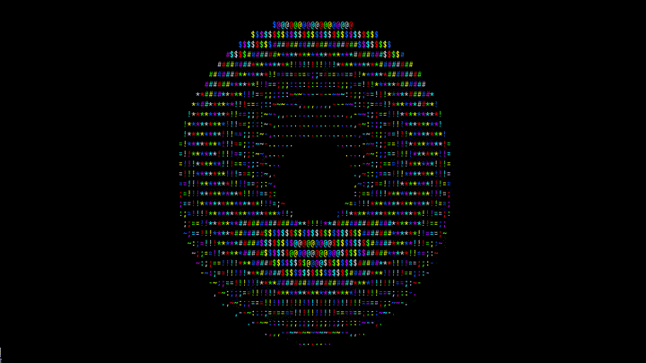

# Spinning Donut in C

This project renders an animated spinning donut in the terminal using C. The donut is rendered using ASCII characters and cycles through a series of colors to create a dynamic visual effect.

## Demo

### One spinning donut



### Two spinning donuts


## Features

- ASCII art rendering of a spinning donut
- Color cycling for visual effect
- Adjustable rotation speeds

## Getting Started

### Prerequisites

- A C compiler (e.g., `gcc` `tcc`)
- A terminal that supports ANSI escape codes for color

### Building and Running

```bash
git clone https://github.com/elbachir-one/donut.git
cd donut/
make
./donut
```
### Note

If you want to display only one donut, you can do so in the config.h file by changing the option from one to zero.

## Contributing

Contributions, issues, and feature requests are always welcome! Thank you.
